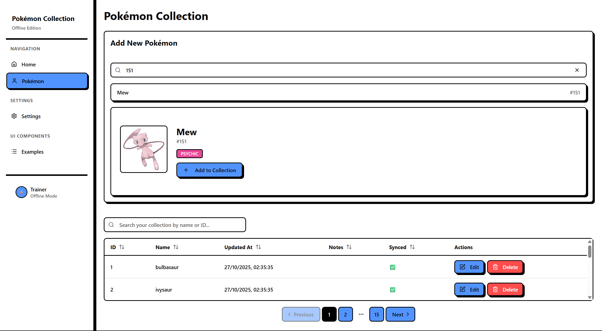
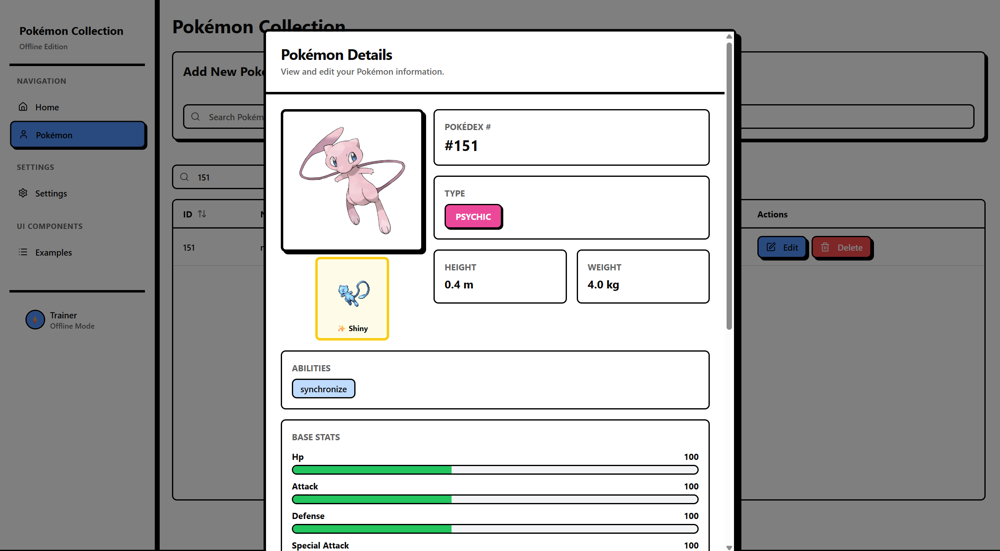

# Pokémon Collection - Offline-First Electron App

A robust, offline-capable Pokémon collection application built with Electron, React, and IndexedDB. This app demonstrates modern offline-first architecture patterns with automatic data synchronization, conflict resolution, and optimistic UI updates.

## 🌟 Features

- **Offline-First Architecture**: Full functionality without internet connection
- **Automatic Data Sync**: Periodic synchronization with the PokéAPI server
- **Conflict Resolution**: Intelligent merging of local and server changes
- **Optimistic Updates**: Instant UI feedback for all user actions
- **Queue-Based Mutations**: Reliable mutation tracking and retry mechanism
- **Cross-Platform**: Runs on Windows, macOS, and Linux via Electron
- **Modern UI**: Built with React, TanStack Router, and shadcn/ui components
- **Type-Safe**: Full TypeScript implementation for better developer experience
- **Local Database**: IndexedDB with Dexie.js for efficient data storage

## 🚀 Tech Stack

- **Frontend**: React 18 with TypeScript
- **Routing**: TanStack Router for type-safe routing
- **State Management**: TanStack Query (React Query) for server state
- **Local Storage**: IndexedDB via Dexie.js
- **Desktop Framework**: Electron
- **Build Tool**: Vite
- **UI Components**: shadcn/ui with Tailwind CSS
- **API**: PokéAPI for Pokémon data
- **Code Quality**: Biome for linting and formatting

## 📋 Prerequisites

- Node.js (v16 or higher)
- npm or yarn

## 🛠️ Installation

```bash
# Clone the repository
git clone https://github.com/calindoran/offline-electron-app.git

# Navigate to project directory
cd offline-electron-app

# Install dependencies
npm install
```

## 🎮 Usage

### Development Mode

```bash
# Run the app in development mode with hot reload
npm run dev
```

This starts both the Vite dev server and Electron in development mode with DevTools enabled.

### Production Build

```bash
# Build the React app
npm run build

# Run the production version
npm run start:prod

# Package for macOS
npm run pack

# Package for Windows
npm run pack:win

# Package for both platforms
npm run pack:all
```

## 📸 Screenshots






## 📱 Application Features

### Pokémon Collection Management
- Browse and search through 150 Pokémon
- View detailed Pokémon information (types, abilities, stats, sprites)
- Add custom notes to your favourite Pokémon
- Track your collection offline

### Offline Capabilities
- Full CRUD operations work without internet
- Changes are queued and synced when connection is restored
- Local-first reads ensure instant app responsiveness
- Smart conflict resolution when server data changes

## 🏗️ Architecture Overview

This application implements a sophisticated offline-first architecture with the following key components:

### Data Synchronization
- **Pull Strategy**: Fetches Pokémon data from PokéAPI and stores locally
- **Push Strategy**: Queues local mutations and syncs to server when online
- **Conflict Resolution**: Automatically resolves conflicts using timestamp-based merging

### Storage Layer
- **IndexedDB Tables**:
  - `items`: Stores Pokémon data with user notes
  - `mutationQueue`: Tracks pending CRUD operations

### Service Layer
- **syncService**: Manages bidirectional data synchronization
- **queueService**: Handles mutation queuing and replay
- **conflictResolver**: Resolves data conflicts between local and server state
- **apiClient**: HTTP client with error handling

## Data Flow Diagram
             ┌─────────────┐
             │   Server    │
             │ (API CRUD)  │
             └─────┬──────┘
                   │
           Pull Delta Changes
                   │
                   ▼
           ┌─────────────┐
           │  SyncService │
           │ pullServer   │
           │ syncPending  │
           └─────┬───────┘
                 │
    Conflict Resolution / Merge
                 │
                 ▼
           ┌─────────────┐
           │ IndexedDB   │
           │  (Dexie)    │
           │ items table │
           └─────┬───────┘
                 │
                 │ Local Reads
                 ▼
          ┌─────────────┐
          │ React Query │
          │  useItems   │
          └─────┬───────┘
                 │
                 │ Provides data to
                 ▼
           ┌─────────────┐
           │ UI (React)  │
           │ Table/Form  │
           └─────────────┘

------------------------------------------------
Offline Mutation Flow (Queued Actions)
------------------------------------------------
           ┌─────────────┐
           │ UI (React)  │
           │ ItemForm    │
           └─────┬───────┘
                 │
       Add / Update / Delete
                 ▼
           ┌─────────────┐
           │ useMutateItem│
           │  Optimistic │
           └─────┬───────┘
                 │
          Writes to Local DB
                 │
          Adds to Queue Table
                 ▼
           ┌─────────────┐
           │ mutationQueue│
           │  (Dexie)    │
           └─────┬───────┘
                 │
           SyncService periodically
                 │
           Push mutations to Server
                 ▼
             ┌─────────────┐
             │   Server    │
             │ (API CRUD)  │
             └─────────────┘

## 📊 Detailed Flow Explanation

### 1. Local Reads (Offline-First)

- UI components (Table/Form) always read from IndexedDB via React Query (`useItems` hook)
- Ensures offline-first rendering with instant data availability
- No network dependency for viewing data

### 2. Offline Mutations (Optimistic Updates)

- Any create/update/delete operation in the UI goes through `useMutateItem` hook
- Immediately updates IndexedDB (optimistic update) for instant UI feedback
- Queues the mutation in `mutationQueue` table for later synchronization
- User sees changes instantly, even without internet connection

### 3. Sync Service (Background Synchronization)

- `useDataSync` hook periodically executes:
   - **Push**: Sends queued mutations to the server
   - **Pull**: Fetches server-side changes and updates
- Applies conflict resolution when local and server data diverge
- Runs automatically in the background without blocking the UI

### 4. Server Integration

- Receives mutations and processes them via REST API
- Sends delta changes on pull requests
- Client merges changes into IndexedDB with smart conflict resolution

## 🔧 Project Structure

```
offline-electron-app/
├── electron/              # Electron main process
│   ├── main.js           # App entry point
│   └── preload.js        # Preload scripts
├── src/
│   ├── components/       # React components
│   │   ├── ui/          # shadcn/ui components
│   │   ├── DataTable.tsx
│   │   ├── ItemsTable.tsx
│   │   └── PokemonSearch.tsx
│   ├── contexts/         # React contexts
│   ├── db/              # IndexedDB setup
│   ├── hooks/           # Custom React hooks
│   │   ├── useDataSync.ts
│   │   ├── useItems.ts
│   │   └── useMutateItem.ts
│   ├── routes/          # TanStack Router routes
│   ├── services/        # Business logic
│   │   ├── apiClient.ts
│   │   ├── syncService.ts
│   │   ├── queueService.ts
│   │   └── conflictResolver.ts
│   └── types/           # TypeScript definitions
├── assets/              # App icons and resources
└── dist/                # Production build output
```

## 🧪 Testing

TBD!

## 🎨 Theming

The app includes a theme provider with light/dark mode support. Themes can be toggled from the settings page.

## 🤝 Contributing

Contributions are welcome! Please feel free to submit a Pull Request.

## 📄 License

This project is licensed under the MIT License - see the LICENSE file for details.

## 👤 Author

**Calin Doran**

## 🙏 Acknowledgments

- [PokéAPI](https://pokeapi.co/) for providing the Pokémon data
- [shadcn/ui](https://ui.shadcn.com/) for beautiful UI components
- [Dexie.js](https://dexie.org/) for the excellent IndexedDB wrapper
- [TanStack](https://tanstack.com/) for Query and Router libraries
